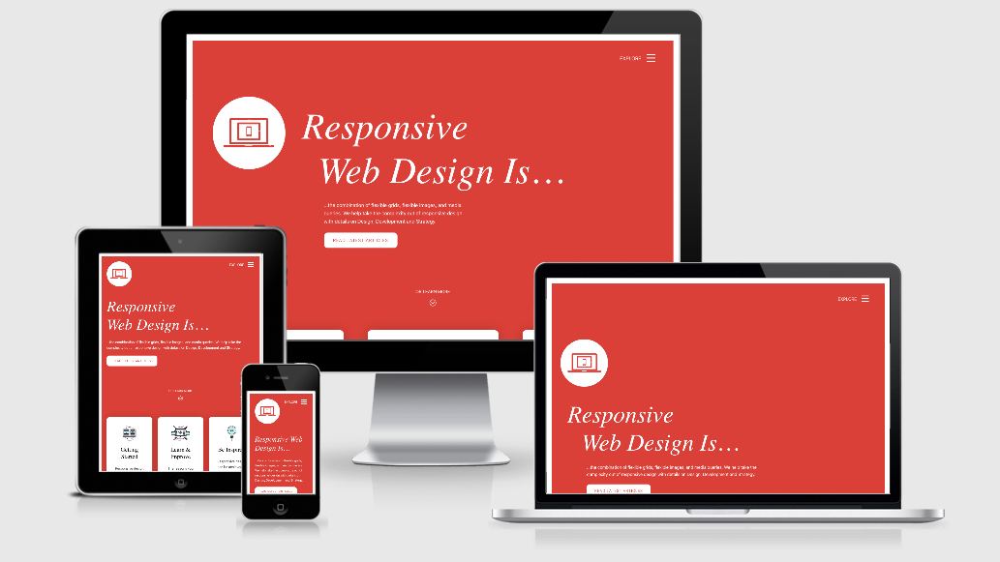
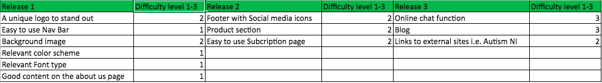

# Embrace Autism

## Code Institute - Milestone Project 1

----

This milestone project is the first of four that is to contribute towards my Full Stack Web Developer Diploma with Code Institute. The main requirements in this project is to design a responsive website using HTML5 and CSS3 with the option of using CSS libraries/frameworks like Bootstrap. There is a miniumum requirement of three web pages or three separate sections on one page. I chose to go with four webpages as I wanted to keep the homepage content minimum, the about and ideas pages relevant with the right level of content and a fourth page offering users the option to subscribe. All this i feel would work well when using the menu bar to navigate around the site.

Embrace Autism is a fictional information website that is mainly aimed at parents of those who have a child with a diagnosis of Autism (ASD – Autistic Spectrum Disorder). The website provides advice and ideas on how to occupy and keep Autistic children happy, engaged and active. As a father of an Autistic child, I know how difficult it can be to entertain and keep your child happy and fulfilled. Therefore, I had the idea to design a website that can offer help and advice drawn upon my own experiences. Embrace Autism is a website that you can access time and time again to get new ideas, parent to parent advice and useful links to external websites relevant to ASD. There is the option to subscribe to Embrace Autism mailing list by providing your name and email address to get regular new ideas, free of charge. 

Every Friday morning my wife and I attend an Autism intervention workshop online with other parents and NHS professionals to discuss the best ways to help when raising a child with Autism. The knowledge gained is often information i like to share with other parents and therefore the Embrace Autism website idea i believe is the perfect platform to offer the information gained from these workshops.   

Date this project started: 9th March 2021

[Click here to view the Embrace Autism project website live](https://embraceautism2.godaddysites.com/)

## UX (main aims, user stories, design process)
---

### Main aims
* To inform other parents of potential new ways to help in their day to day life when bringing up their Child with Autism.
* Offer suggestive ways to improve the quality of life for all members of the family involved.
* To encourage parents and their children not to ignore the condition but instead realise what it is, embrace it and find ways that will work to understand and cope well with it.  
* To let parents know that they aren't alone and that there are many other parents and families out there that have been through challenging times when raising a child with Autism. 
* To make it easy for all users to navigate around the site using the menu navigation bar with the option to read more about the service being offered.
* To make it easy and quick to subscribe for weekly/monthly updates offering the user help and advice in the form of a mailing list. 
* To offer useful links to creditable charities and organisations that can offer more in-depth advice and support.
* The main aim from a developers point is to maximise as many subscribed members on Embrace Autism's mailing list as possible by encouraging users to complete the very quick and easy subscribe form.

### User Stories
* I am a parent with a young child that's just been diagnosed with Autism. I need some general advice on what to do, now that I know what my child's condition is. I don't necessarily need specific advice at this stage, I just need to be pointed in the right direction.  
**EA Response - Embrace Autism offers useful links to charities that specialise in Autism all over the UK. These links can be found on the about and resources pages. For example: Clicking the link to the National Autism Society will offer this parent the right step towards long term help and support. For Northern Ireland parents it would be best to click on the Autism NI charity which is also a link available on the website.** 

* I have a teenage Son who has Autism. He only wants to play on his computer games. He hardly leaves the house and I'm concerned about his health and wellbeing.  
**EA Response - There would be advice on the website to support this parent, often related to encouraging routines and good habits to get into.** 

* I have five children. The two youngest have been diagnosed with Autism at different levels on the spectrum. I spend a lot of time with them which leaves little time left to spend with my older children and husband. I am in need of some support to free up more time whilst keeping all my children happy and entertained.  
**EA Response - by subscribing to the Embrace Autism mailing, this parent will get regular updates with new ideas, tips and advice to help free up more time with all members of her family. They can also take a look at the useful links to see whether one of the charties can offer some additional advice** 

* I work for a large Autism charity and see that Embrace Autism is offering advice and support from a parent's point of view with experience raising a child on the Autistic spectrum. How do I reach out to the founders of this website to provide more information and advice to help assist their site visitors?  
**EA Response - There is the option to contact Embrace Autism by email. To send an email the user will need to click the email envelope icon which can be found within the footer next to the social media icons. The user can click the icon to open a draft email within their device. The draft will have the pre-prepopulated email address of info@embrace-autism.co.uk in the recipient section of the email. The user can then complete the email and when ready, click send.** 

* I'm a teenager with Autism. With my high level sensory needs, I find it difficult to wear masks when i'm in shops and with most shops insisting i wear one, its becoming very tough to go out. Is there anything i can do to make it easier when visiting shops
**EA Response - This user can click any of the useful links to gain useful information. The user will find within the Hidden Disabilities link the option to get a free green and yellow sunflower identity ribbon which can be used when out shopping without the need for wearing a mask.** 

## Design Process 

1. I knew I wanted to create a website based on a subject that is close to my heart. I came up with a good name "Embrace Autism" for the website and knew early on what type of site it was going to be, who it was aimed for and what it can offer. Once I had completed the Strategy and Scope planes knowing what was and what wasn't needed or achievable, I then focused on the structure and layout. 

## Strategy trade-off

## Scope Plane diagram

* I wanted to keep the Structure straightforward so that all users visiting the site would see the same flow, patterns and layout making their experience on the site enjoyable and easy to navigate around.  

* The content for the website mainly came from my own experiences and therefore this took a little time to put together. I used a couple of external sources to help with the content from other Autism websites I am familiar with. Credits to these sites can be found at the bottom of this README document for reference with the 'Credits' section.  

* Once I knew what structure I had in mind I moved onto the Skeleton plane and used Balsamiq wireframes to start some blueprints on how the website looked. Initially i was building a website with three pages, however, after going through the design process early on i knew that four pages was needed to spread out the right level of content in the right places which i know would offer better overall UX.  

* I wanted to make sure there was consistence with regards to the header (logo name and navigation menu) and footer throughout all pages (social media icons, email icons and copyright text). I also wanted to show an even and relevant amount of information depending on which page the user is on.  

* I wanted the website to have a minimum of three pages, home (index.html), about (about.html) and subscribe (subscribe.html). However, as mentioned above a fourth page for ideas (ideas.html) would be needed to help structure the content in the right place. I also considered a blog page, however, at this stage I feel that this wouldn’t be needed for a new website like this. 

* As my target audience would be mainly other parents with a child on the Autistic spectrum, the design I wanted to achieve is a clean and friendly website that is easy to use, gain useful information and subscribe to a mailing list. I also wanted to make sure the website was attractive enough for victors to return back to as they would be aware that new information would be added regularly. In order to get the right style website, I felt the layout of the site, colour schemes and font choices were going to be an important part of the design process. I took my time testing different font styles in Google Fonts and chose the Ubuntu : Sans-serif font family for most of the website content. The Ubuntu font was chosen as it appears friendly and very readable to the eye. I chose the Kalam : cursive font family for the logo text (curive will only be used if the Kalam font doesn't load), homepage cover text and where ever the word 'Autism' appeared throughout the site. The Kalam font was chosen to stand out and show as a striking style to the eye and completely different to most of the website content. At the same time both fonts I believe work well together which was equally important to have. 

## Design Process page by page

* The home and subscribe pages have minimum content. The home page has been designed to gain the users attention and encourage them to easily navigate to the about page, resources page and then onto the subscribe page to register. 

* I changed the colour of the website a couple of times and used coolors.co to assist with a couple of colours that worked well to compliment the light blue i had already found and that I wanted to use. The coolors.co colours chosen was a dark blue and very light grey. I needed a colour to stand out when buttons are being hovered over. Therefore, I picked a strong green to achieve this. 

Full details of all colours used for the website can be found below: - 

    - Light Blue: hex:479ce0, rgb:71,156,224, hsl:207°,71%,58%  
    - Dark blue (from coolors.co) hex:274c77, rgb:39,76,119, hsl:212°,51%,31%  
    - Very light grey (from coolors.co) hex:e7ecef , rgb:231,236,239, hsl:202°,20%,92%  
    - Hover green hex:3b9e3b, rgb:59,158,59, hsl:120°,46%,43%  

* When starting the design of the website the first thing I wanted to do was set the default font style, font colours and background colours within the body element.  

Full details can be found below for reference: - 

    - Font-family - Ubuntu : sans-serif (sans-serif will only be used if Ubuntu doesn't load)
    - Font colour - Dark blue: hex:274c77 
    - Background Colour – Very light grey: hex:e7ecef 

* The homepage design went through a few trials with choosing the right type of image I wanted and the positioning of it. When I found this image <a href="https://www.istockphoto.com/photo/child-and-adult-hands-holding-colorful-heart-on-blue-sky-background-world-autism-gm1213547010-352734294" target="_blank">click here</a> I knew it would work well for what I wanted achieve on my landing page.  

* I wanted to offer users the option of making contact by email. I was going to apply a generic email address at the top of the homepage, however after moving it about a few times i decided to add a fourth icon next to the social media icons within the footer of every page which looked much more professional.  

* I wanted to use all colours pre-picked for the homepage website to maximise the attraction of this page. Starting with the cover text highlighting three benefits about the website. The text was formatted as an unordered list with the bullet points removed. At first the unordered list was nested in a div element; however, I wanted the list to sit inside a semantic element to show improved web developmemt. I used the aside element to achieve this. On desktop screen size, the colours I chose for the cover text list was dark blue with a light grey background colour using rgba(106, 112, 116, 0.7). The 'alpha' was used to show a softened colour background and to appear to blend into the hero image. On small laptop, tablet and mobile screen sizes the cover text sits below the hero image with the background colour in dark blue and the font colour in light grey.  

* There was an ordered list using numbers 1-3 giving an easy step by step process to move throughout the website. However, after careful consideration I decided to remove the ordered list and strengthen the look of the navigation menu bar with clear text throughout.   

* Below the cover text there is a 'SUBSCRIBE FOR FREE' button which is linked to the subscribe page. On desktop screen sizes this button is dark blue with the text in light grey. On small laptop, tablet and mobile screen sizes the button sits below the hero image, header and cover text. The background colour of the button on smaller screens is light blue and the font colour in light grey. The wording is in capital letters and when hovering over this button the background colour of the button changes to a strong green colour showing the user that it can be clicked.

* After removing the ordered list, I had the option to increase the size of the cover text and 'SUBSCRIBE FOR FREE' button making both more visible to users.  

* I decided to add a h1 header to complete the design of the homepage, stating what the website is about in the form of a short sentence. On large screen sizes the colour of this is dark blue in Ubuntu font styling except for the word 'Autism' which is in Kalam font. It can be found above the cover text and inside to the right of the hero image. On small laptop, mobile and tablet size screens this header is below the hero image and above the cover text in the centre of the screen. The header colour is light blue with the word 'Autism' in dark blue to make it stand out more on smaller devices. 

* The about page has a dark blue background colour within the main body. The Ubuntu font is used for all content in light grey. The structure of the page leans to the left side to make it look more professional. The page holds information in the form of a sub headers, paragraphs, an unordered list (bullet points) a factsheet and a short video clip about Autism. The information you will find on this page is about my family's personal journey with Autism, the websites goals, next steps, subscribe button to click on and useful external links at the bottom just above the footer. The factsheet has contrasting colours with a light grey background and dark blue font colour. This is done purposely to stand out from the page. At the bottom of the factsheet there is small text confirming the source of the fact in red. This is also a link to click on which takes the user straight to the relevant website of where the fact came from. Within the bullet points inside the Website Goals section, there is a couple of additional links to the resource and subscribe pages to encourage users to click on. These link words are in a light blue colour to stand out from the rest of the text. The 'SUBSCRIBE FOR FREE' button wording is in capital letters and when hovering over this button the colour changes to a strong green. There are also horizontal breaks between each section within this page to make it easy to navigate through. The layout is identical on all screensizes with minimal changes made using media queries to adjust the factsheet, subscribe button and useful links section. 

* The resources page has a dark blue background colour within the main body just like the about page. The Ubuntu font is used for all content with a light grey colour finish. The main purpose for this page is to provide users with clear to read information. I decided to keep this page simple with the option to read and much or as little as the user wanted. This is done using the CSS overflow declaration and scroll value. I wanted all information pieces to sit inside a semantic element to show improved web development. I replaced the div elements with the article elements to achieve this. There are also horizontal breaks between each information paragraph to make it easy to navigate throughout the page. Below the information paragraphs there is some additional content encouraging the user to visit the subscribe page to register. Underneath this content there is a 'SUBSCRIBE FOR FREE' button which is linked to the subscribe page. This button is light blue with the text in dark blue. The wording is in capital letters and when hovering over this button the background colour changes to a strong green. Below the button there is a useful links section which includes three charity organisation logos for users to click on. These links are external to the websites of the charities. When clicked the user will see that the external website will open in a new tab page on their browser. This is to make sure that if the user wants to return to Embrace Autism, the site is still open to easily go back to. The layout is identical on all screensizes with minimal changes made with media queries to adjust the subscribe button and useful links section.   

* For the about and resources pages, I used bootstrap containers, rows and columns to structure the layout of this page which made it easier to manage with regards to responsive design. 
 
The subscribe page [content to follow]

* Media queries - all pages (index.html, about.html, resources.html and subscribe.html) 

    - The navigation bar is created using Bootstrap5 and therefore mobile first responsive. From small mobiles up to and including tablets the navigation bar is formatted as a hamburger menu (3 horizontal bars, one on top of the other) I checked all screen sizes and it was only the largest screen (2560px) that needed media queries adding to change the positioning of the logo text and navigation bar.  

    [logo text to be moved to the left and the navigation bar to the right - to be completed] 

    - The footer has minimum content with icons and a very short paragraph included. For good UX I centred the footer and therefore on any device this will appear central and easy to view and use when clicking a particular social media or email icon. 

* Media queries - homepage (index.html) 

    - The Hero-image, h1 header, cover text and subscribe button has been adjusted and repositioned to fit within all screen sizes. The header, cover text and subscribe button is all positioned below the hero image for small mobiles up to and including tablets. This I believe offers better overall UX. 

* Media queries - about page (about.html) 

    - The factsheet font size, height and width has been adjusted to fit on smaller screens. 
    - The 'useful links' logos needed to be reduced in size and re-positioned to fit on smaller screens. A long with this the sub header above these logos also had to be adjusted in size to keep in preportion with the logos.  
    - The Subscribe button needed to be adjusted in size for both small screens and large screens. Again this was to keep in preportion with everything else on the page.

* Media queries - resources page (resources.html) 

    - The h4 header in the articles needed to be adjusted on the large screen size.
    - The subscribe button needed to be adjusted on most screen sizes to look in preportion with the web page. 
    -TBC

1. Media queries - subscribe page (subscribe.html) 

Use this section to provide insight into your UX process, focusing on who this website is for, what it is that they want to achieve and how your project is the best way to help them achieve these things.

In particular, as part of this section we recommend that you provide a list of User Stories, with the following general structure:

As a user type, I want to perform an action, so that I can achieve a goal.
This section is also where you would share links to any wireframes, mockups, diagrams etc. that you created as part of the design process. These files should themselves either be included as a pdf file in the project itself (in an separate directory), or just hosted elsewhere online and can be in any format that is viewable inside the browser.

## Wireframes (Balsamiq)
---

[a link to be added here for mobile devices]

[a link to be added here for desktop devices]

[a link to be added here for tablet devices]

[a link to be added here directly to the completed wireframe page]

## Features
---

In this section, you should go over the different parts of your project, and describe each in a sentence or so.

### Existing Features

#### All pages  

* My project has 4 web pages with the same header and footer formatted. All pages are connected to each other by using the relevant link options at the top of each page in the menu navigation bar. The defaults set across all pages are as follows: -  

* The header has a text logo called 'Embrace Autism' at the top left of every page in dark blue. When hovering over the logo text the colour changes to light blue. This gives the user an indication that it’s a link and when clicked, it will bring the user back to the homepage (index.html) for convenience. On the right side of the header there is a horizontal navigation bar showing the following pages available: - home, about, resources and subscribe. All menu bar text is in uppercase. The font colour is light blue and when hovering over one of the page titles, the colour will change to dark blue. This was achieve by using the pseudo class, hover. This shows the user that these page titles are links, and that when hovering over one of them, it can also be clicked to move to that particular page within the site. A user will know what page they're on because the relevant page title will be highlighted in dark blue and underlined in the same colour. At this time the other pages will be shown in light blue. This gives the user clear indication of what page they are currently on and what pages are available to hover over and click on as and when they want to do this. The navigation in mobile and tablet size screens changes to a hamburger menu (3 horizontal bars, one on top of the other). The only difference is that when the bar is clicked the pages open up in a drop down menu. The page the user is on is still highlighted with the dark blue colour but there isn't an underline. 

* The footer has social media icons to Facebook, Instagram and Twitter. These are all links to the relevant sites making it easy for a user to click through to. Each link will be opened in a new tab making it easy for the user to come back to the Embrace Autism site as it will still be open on the user's browser. There is an email icon next to the social media icons which will give users the option to click on. This will open up a new blank email draft ready to use and send back to Embrace Autism's generic email account. All four icons are structured evenly in the centre of the screen at the bottom of every page. There is good spacing between each icon to make it easy for users to click on without making the mistake of clicking the wrong one. All icons have the colour of light blue. When the user hovers over a particular icon the colour turns dark blue showing the user which icon they are about to select. Below the icons there is a short paragraph for ‘copyright’ which again is central and at the bottom of every page. The colour of this paragraph is dark blue. 

#### Homepage (index.html)  

* The main feature of this page is a large hero image with a light blue cloud like background. At the forefront of the image there is two sets of hands embracing a small heart-shaped colourful object. This image will indicate to users that it's a loving, embracing and welcoming site which should gain immediate attention. When I checked the description of this image, I found that the two sets of hands are in fact from one adult and one child making the image very relevant to the name of the website and the audience its aimed towards.  

* A header stating what the website is about and who is it for 

* There is a small list of website benefits  

* A 'SUBSCRIBE FOR FREE' button. This is linked to the subscribe page making it easy for the user to click on and sign up. When hovered over the background the colour changes  

#### About (about.html)  

* This page has a dark blue background colour with a light grey text colour. The font is the default Ubuntu with the word 'Autism' in the Kalam font to match the logo text.  

* The page holds a header (Our Autism Journey) with three short paragraphs below.  

* There is another header (Website goals) with 3 bullet points in the form of an unordered list. Within this bullet point texts there is a couple of links to different pages within the site. These links are easily visible as the colour of the word links is in light blue and can be clicked by users at any time to move to either the resource page or subscribe page.  

* There is a factsheet with a background colour is light grey with the font colour being dark blue There is some small text within this section stating where the factsheet information was sourced from. This text is in red an is also a link to the exact page relevant to the information in the factsheet.  

* MEDIA CLIP - to be added 

*There is another sub header (The next step) with a short paragraph. This gives the user additional information on what they can do next. i.e., subscribe or use the links below to look at external links  

* A 'SUBSCRIBE FOR FREE' button. This is linked to the subscribe page making it easy for the user to click on and sign up. When hovered over the background the colour changes   

* This page also has Links to external sources i.e., National Autistic Society, Autism NI, Hidden Disabilities. All charity logos very visible to see at the bottom of the page just above the footer. These logos are positioned on a white background with enough room between each one, making it easy to click the right one. Clicking any of the logos will bring the user to the homepage of whichever one is clicked. This will open in a separate tab on the user's browser making it easy to navigate back to the Embrace Autism site as it will still be open.  

#### Resources (resources.html)

1. Header (what worked for use)
1. Sub header - 'Take your child out everywhere' and Paragraph
1. Sub header - 'Routines and good habits' and Paragraph
1. Sub header - 'Free up time is easier than you think' and Paragraph
1. Sub header - 'To be confirmed' and Paragraph 
1. All above sub headers and corresponding paragraphs have been placed in a text box giving the user the option to pick which one to read. Each text box has a scroll option making it easy to read whichever article the user is interested in. The background colour of each article is light grey (hex:e7ecef). The font colour is dark blue (hex:274c77) with the default font of Ubuntu used.
1 There is another sub header (The next step) with a short paragaph below giving the user additional information on what they can do next. i.e. subscribe or use the links below to click on to external websites associated with Autism.
1. A subscribe button to click and subscribe free, quick and easy.  
1. Links to external sources i.e. National Autistic Society, Autism NI, Hidden Disabilities.  

#### Subscribe (subcribe.html)

1. A form section for subscribing to the Embrace Autism mailing list.  
1. The form will include a name and email section to complete along with the choice of either a weekly or monthly subscription by selecting the relevant radio buttons.
1. A submit button will be at the bottom of the form and once clicked a Modal message will appear to show the user the form has been completed and submitted successfully. 
1. Some text and paragraph [to be completed]
1. Thank you image [to be added]
1. Links to external sources i.e. National Autistic Society, Autism NI, Hidden Disabilities. 

[Modal to be completed]

### Mobile responsive

### Tablet responsive

* Feature 1 - allows users X to achieve Y, by having them fill out Z
* ...

For some/all of your features, you may choose to reference the specific project files that implement them, although this is entirely optional.

In addition, you may also use this section to discuss plans for additional features to be implemented in the future:

### Features Left to Implement
1. I liked the option of adding an ideas and advice page, however, as its a new website i would need more time to develope this page as there would need to be plenty of ideas and advice over a longer period of time in order for this page to work. 
1. I considered a blog page however, i felt that at this stage the website needs to gain plenty of subcribers first before a blog can be added.
1. I also considered the option of a live chat page for parents to talk to each other and share ideas. However, the website would need to more established first and at this stage in the course i feel i don't have the skillset to implement this.
1. To lead on from the chat page idea, i would like to make sure that there is some level of security and understand the responsbilities of offering a secure website with a live chat feature. This also leads on to the idea of offering a login option for users which would tie into the website having the right level of security. 

* Another feature idea

## Technologies Used
---

In this section, you should mention all of the languages, frameworks, libraries, and any other tools that you have used to construct this project. For each, provide its name, a link to its official site and a short sentence of why it was used.

* HTML5 (All content, elements and attributes)
* CSS3 (All styling rules)
* Bootstrap5 (To assist and speed up styling)
* Balsamiq (Wireframing)

## Testing
---

When testing the website on different screen sizes i made the decision to change the layout of the homepage for mobiles and tablets against laptop and desktop. The header, cover text and subcribe button is within the hero image on desktop and laptop. On smaller screens like mobile and tablet i decided to reduct the size of the image in order for the user to see the whole image clearly and have the header, cover text and subcribe button below. This i believe makes the UX better to read. I made sure the subscribe button stayed a good size to making it clear to click on by the user.

When testing the navigation bar on smaller screens this would appear as a hamburger menu (3 horizontal bars) which is what i wanted to achieve. However,the originally styling i made included a bottom border showing a user which page they are on not just by the colour change but by the border-bottom declaration which a solid thin line as a value. This didn't work well on the smaller screens when the navigation menu became a hamburger menu. I therefore removed this using media queries upto 991px which is the break point between the navigate menu changing from hamburger menu and full size. 

In this section, you need to convince the assessor that you have conducted enough testing to legitimately believe that the site works well. Essentially, in this part you will want to go over all of your user stories from the UX section and ensure that they all work as intended, with the project providing an easy and straightforward way for the users to achieve their goals.

Whenever it is feasible, prefer to automate your tests, and if you've done so, provide a brief explanation of your approach, link to the test file(s) and explain how to run them.

For any scenarios that have not been automated, test the user stories manually and provide as much detail as is relevant. A particularly useful form for describing your testing process is via scenarios, such as:

1. Contact form:
    * Go to the "Contact Us" page
    * Try to submit the empty form and verify that an error message about the required fields appears
    * Try to submit the form with an invalid email address and verify that a relevant error message appears
    * Try to submit the form with all inputs valid and verify that a success message appears.

In addition, you should mention in this section how your project looks and works on different browsers and screen sizes.

You should also mention in this section any interesting bugs or problems you discovered during your testing, even if you haven't addressed them yet.

If this section grows too long, you may want to split it off into a separate file and link to it from here.

## Deployment (Date this project was deployed: TBC)
---

This section should describe the process you went through to deploy the project to a hosting platform (e.g. GitHub Pages or Heroku).

In particular, you should provide all details of the differences between the deployed version and the development version, if any, including:

* Different values for environment variables (Heroku Config Vars)?
* Different configuration files?
* Separate git branch?

In addition, if it is not obvious, you should also describe how to run your code locally.

## Credits
---

### Content
* I obtained content and adapted it for the resources page paragraph titled -  Don't stop going out. The content was taken from <a href="https://www.autismspeaks.org/blog/11-tips-new-autism-parents" target="blank">Autism Speaks</a> - (10) Take your kid out everywhere.
* I obtained content for the resources page paragaph titled -  Routines and good habits. The content was take from <a href="https://www.marcus.org/autism-resources/autism-tips-and-resources/establishing-routines-at-home" target="blank">Marcus Autism Center</a> - Establishing routines at home (Why children with autism need routines at home)
* I obtained content for the resources page paragraph titled -  Tips for New Autism Parents. The content was taken from <a href="https://www.appliedbehavioranalysisedu.org/6-strategies-for-encouraging-a-non-verbal-child-to-communicate/" target="blank">Applied Behavior Analysis Edu</a> - 6 Strategies for Encouraging a Non-Verbal Child to Communicate.

### Code
* <a href="https://www.w3schools.com/tags/tryit.asp?filename=tryhtml_link_mailto" target="blank">Link to my email icon</a> supplied by my mentor - Seun Owonikoko using 
<a href="https://www.w3schools.com/tags/" target="blank">w3schools</a>.

### Factsheet
* I obtained factural information to support my about page factsheet. The information was taken from the <a href="https://www.bma.org.uk/what-we-do/population-health/child-health/autism-spectrum-disorder#:~:text=It%20is%20estimated%20that%20around,have%20a%20diagnosis%20of%20autism." target="blank">British Medical Association (BMA)</a>.

### Media
* I received inspiration for this project by using images supplied by the <a href="https://www.istockphoto.com/portfolio/vejaa?assettype=image&mediatype=photography" target="blank">Photography - Vejaa</a>.

    - <a href="https://www.istockphoto.com/photo/child-and-adult-hands-holding-colorful-heart-on-blue-sky-background-world-autism-gm1213547010-352734294" target="_blank">Chosen homepage hero image</a> by photography - Vejaa
    - <a href="https://www.istockphoto.com/photo/child-and-adult-hands-holding-colorful-heart-on-blue-sky-background-world-autism-gm1213547010-352734294" target="_blank">Chosen subscribe page image</a> by photography - Vejaa
    - Images sourced from istockphoto.com (to be purchased £?? each)

* The text for section Y was copied from the Wikipedia article Z

### Acknowledgements    

* My Mentor - Seun Owonikoko  

### Notes

* This website isfor educational purposes only and created for my Code Institute User Centric Frontend Development Milestone Project (MS1)

Welcome Liam Walsh,

This is the Code Institute student template for Gitpod. We have preinstalled all of the tools you need to get started. You can safely delete this README.md file, or change it for your own project. Please do read it at least once, though! It contains some important information about Gitpod and the extensions we use.

## Gitpod Reminders

To run a frontend (HTML, CSS, Javascript only) application in Gitpod, in the terminal, type:

`python3 -m http.server`

A blue button should appear to click: *Make Public*,

Another blue button should appear to click: *Open Browser*.

To run a backend Python file, type `python3 app.py`, if your Python file is named `app.py` of course.

A blue button should appear to click: *Make Public*,

Another blue button should appear to click: *Open Browser*.

In Gitpod you have superuser security privileges by default. Therefore you do not need to use the `sudo` (superuser do) command in the bash terminal in any of the lessons.

## Updates Since The Instructional Video

We continually tweak and adjust this template to help give you the best experience. Here is the version history:

**October 21 2020:** Versions of the HTMLHint, Prettier, Bootstrap4 CDN and Auto Close extensions updated. The Python extension needs to stay the same version for now.

**October 08 2020:** Additional large Gitpod files (`core.mongo*` and `core.python*`) are now hidden in the Explorer, and have been added to the `.gitignore` by default.

**September 22 2020:** Gitpod occasionally creates large `core.Microsoft` files. These are now hidden in the Explorer. A `.gitignore` file has been created to make sure these files will not be committed, along with other common files.

**April 16 2020:** The template now automatically installs MySQL instead of relying on the Gitpod MySQL image. The message about a Python linter not being installed has been dealt with, and the set-up files are now hidden in the Gitpod file explorer.

**April 13 2020:** Added the _Prettier_ code beautifier extension instead of the code formatter built-in to Gitpod.

**February 2020:** The initialisation files now _do not_ auto-delete. They will remain in your project. You can safely ignore them. They just make sure that your workspace is configured correctly each time you open it. It will also prevent the Gitpod configuration popup from appearing.

**December 2019:** Added Eventyret's Bootstrap 4 extension. Type `!bscdn` in a HTML file to add the Bootstrap boilerplate. Check out the <a href="https://github.com/Eventyret/vscode-bcdn" target="_blank">README.md file at the official repo</a> for more options.

--------

Happy coding!
