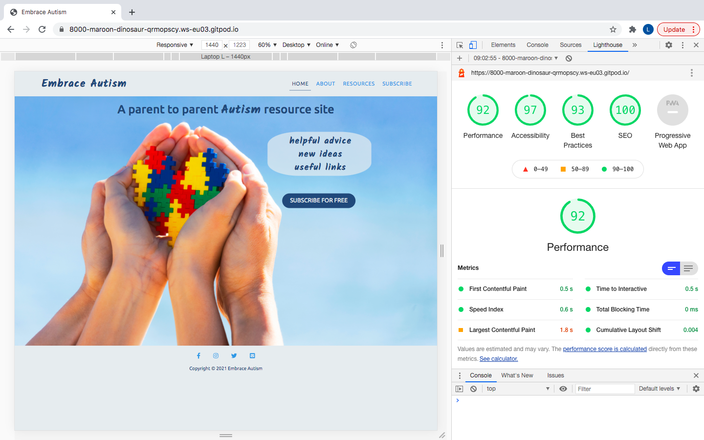

# Embrace Autism

## Code Institute - Milestone Project 1

[Click here to view the Embrace Autism project live](https://embraceautism2.godaddysites.com/)

## Table of contents

1. [Introduction](#introduction)
1. [UX](#ux)
   * [User demographic](#user-demographic)
   * [Main aims](#main-aims)
   * [User Stories](#user-stories)
1. [Development Process](#development-process)
    * [Strategy](#strategy)
    * [Scope](#scope)
    * [Structure](#structure)
    * [Skeleton](#skeleton)
        * [Balsamiq Wireframes](#balsamiq-wireframes)
            * [Homepage wireframe](#homepage-wireframe)
            * [About page wireframe](#about-page-wireframe)
            * [Resources page wireframe](#resources-page-wireframe)
            * [Subscribe page wireframe](#subscribe-page-wireframe)
    * [Surface](#surface)
1. [Design Process page by page](#design-process-page-by-page)
    * [Homepage design](#homepage-design)
    * [About page design](#about-page-design)
    * [Resources page design](#resources-page-design)
    * [Subscribe page design](#subscribe-page-design)
    * [Media Queries](#media-queries)
1. [Features](#features)
    * [Existing Features](#existing-features)
        * [All Pages](#all-pages)
        * [Homepage features](#homepage-features)
        * [About features](#about-features)
        * [Resources features](#resources-features)
        * [Subscribe features](#subscribe-features)
    * [Features Left to Implement](#features-left-to-implement)
1. [Technologies Used](#technologies-used)
    * [Languages Used](#languages)
    * [Frameworks and other Technologies](#frameworks-and-other-technologies)
1. [Testing](#testing)
    * [User stories tested ](#user-stories-tested)
    * [W3C Markup Validation Service](#w3c-markup-validation-service)
        * [Homepage tested](#homepage-tested)
        * [About page tested](#about-page-tested) 
        * [Resources page tested](#resources-page-tested)
        * [Subscribe page tested](#subscribe-page-tested)
    * [W3C CSS Validation Service](#w3c-css-validation-service)
        * [CSS coding tested](#css-coding-tested)
    * [Different Web Browsers](#different-web-browsers)
    * [Testing responsiveness](#testing-responsiveness)
    * [Lighthouse testing](#lighthouse-testing)
        * [Desktop results](#desktop-results)
        * [Mobile results](#mobile-results)
    * [Issues found](#issues-found)
    * [Further testing](#further-testing)
    * [Bugs outstanding](#bugs-outstanding)
1. [Deployment](#deployment)
    * [Github pages](#github-pages)
    * [Forking the GitHub Repository](#forking-the-github-repository)
    * [Making a Local Clone](#making-a-local-clone)
1. [Credits](#credits)
    * [Content](#content)
    * [Code](#code)
    * [Factsheet](#factsheet)
    * [Media](#media)
    * [Media clips](#media-clips)
    * [Other](#other)
1. [Acknowledgements](#acknowledgements)
1. [Notes](#notes)

## Introduction

This milestone project is the first of four that is to contribute towards my Full Stack Web Developer Diploma with Code Institute. The main requirements in this project are to design a responsive website using HTML5 and CSS3 with the option of using CSS libraries/frameworks like Bootstrap. There is a minimum requirement of three web pages or three separate sections on one page. I chose to go with four webpages as I wanted to keep the homepage content minimum, the about page and resources page relevant with the right level of content and a fourth page offering users the option to subscribe on a mailing list. All this I feel would work well when using the menu bar to navigate around the site. 

Embrace Autism is a fictional information website that is mainly aimed at parents who have a child with a diagnosis of Autism (ASD – Autistic Spectrum Disorder). The website provides advice and ideas on how to occupy and keep Autistic children happy, engaged and active. As a father of an Autistic child, I know how difficult it can be to entertain and keep your child happy and fulfilled. Therefore, I had the idea to design a website that can offer help and advice drawn upon my own experiences and what has been taught to me. Embrace Autism is a website that you can access time and time again to get new ideas and useful links to external websites relevant to ASD. There is the option to subscribe to the Embrace Autism mailing list by providing your name and email address (info@embrace-autism.co.uk) to get regular new ideas, free of charge. 

Every Friday morning my wife and I attend an Autism intervention workshop online with other parents and NHS professionals to discuss the best ways to help when raising a child with Autism. The knowledge gained is often information I like to share with other parents and therefore the Embrace Autism website idea I believe is the perfect platform to offer the information gained from these workshops.    

Date this project started: 9th March 2021

[Back to top ⇧](#embrace-autism)

## UX

### User demographic
* Parents/parental guardians of children who have just had a formal diagnoses of Autism
* Parents/parental guardians of children with Autism who may need more support
* Parents/parental guardians who feel their child is on the Autistic spectrum
* Older children with Autism 

### Main aims
* To inform other parents of potential new ways to help in their day-to-day life when bringing up their Child with Autism. 
* Offer suggestive ways to improve the quality of life for all members of the family involved.
* To encourage parents and all member of the family not to ignore the condition but instead realise what it is, embrace it and find ways that will work to understand and cope well with it.   
* To let parents, know that they aren't alone and that there are many other parents and families out there that have been through challenging times when raising a child with Autism. 
* To make it easy for all users to navigate around the site using the menu navigation bar with the option to read more about the service being offered. 
* To make it easy and quick to subscribe for weekly/monthly updates offering the user help and advice in the form of a mailing list.  
* To offer useful links to creditable charities and organisations that can offer more in-depth advice and support.
* The main aim from a developer's point is to maximise as many subscribed members on Embrace Autism's mailing list as possible by encouraging users to complete the very quick and easy subscribe form. By doing this, the Embrace Autism site will gain more popularity and a wealth of subscribers creating a fantastic community of parents going through a similar journey. 

[Back to top ⇧](#embrace-autism)

### User Stories
1. I am a parent with a young child that's just been diagnosed with Autism. I need some general advice on what to do, now that I know what my child's condition is. I don't necessarily need specific advice at this stage, I just need to be pointed in the right direction.    

1. I have a teenage Son who has Autism. He only wants to play on his computer games every day. He hardly leaves the house and I'm concerned about his health and wellbeing. I would like some help with improving my Son's life style.

1. I have five children. The two youngest have been diagnosed with Autism at different levels on the spectrum. I spend a lot of time with them which leaves little time left to spend with my older children and husband. I am in need of some support to free up more time whilst keeping all my children happy and entertained.   

1. I work for a large Autism charity and see that Embrace Autism is offering advice and support from a parent's point of view with experience raising a child on the Autistic spectrum. How do I reach out to the founders of this website to provide more information and advice to help assist their site visitors?  

1. I'm a teenager with Autism and have high-level sensory need. I find it difficult to wear a face mask when I'm in shops and with most shops insisting, people wear one, it's becoming very hard to go out. Is there anything I can do to make it easier for me when shopping? 

[Back to top ⇧](#embrace-autism)

## Development Process 
* I knew I wanted to create a website based on a subject that is close to my heart. I came up with the name "Embrace Autism" for the website and knew early on what type of site it was going to be, who it was aimed for and what it can offer. Once I had completed the Strategy and Scope planes knowing what was and what wasn't needed or achievable, I then focused on the structure and layout. 

### Strategy

### Scope 

### Structure

* I wanted to keep the Structure straightforward so that all users visiting the site would see the same flow, patterns and layout making their experience on the site enjoyable and easy to navigate around. I put together a list of features i wanted 

* The content for the website mainly came from my own experiences and therefore this took a little time to put together. I used a couple of external sources to help with the content from other Autism websites I am familiar with. Credits to these sites can be found at the bottom of this README document for reference within the 'Credits' section.   
* Once I knew what structure I had in mind I moved onto the Skeleton plane and used <a href="https://balsamiq.com/wireframes/?gclid=CjwKCAjw6fCCBhBNEiwAem5SO0TfrA7AKJnwXKFEJStjRK5qFYRfJ7jLW6Vdt4F1CdcujCZRm9Zr7xoC3oUQAvD_BwE" target="_blank">Balsamiq</a> wireframes to start some blueprints on how the website looked. Initially I was building a website with three pages, however, after going through the design process early on I knew that four pages was needed to spread out the right level of content in the right places. This I believe would offer better overall UX. For reference to my wireframes, version three was when the wireframing changed from three to four pages.

[Back to top ⇧](#embrace-autism)

### Skeleton

* Wireframes created using Balsamiq as a blueprint. 

#### Balsamiq Wireframes

- <a href="/workspace/Milestone-Project-1/assets/readme/ux/embrace-autism-wireframes-1.pdf">Wireframe version 1</a>

- <a href="/workspace/Milestone-Project-1/assets/readme/ux/embrace-autism-wireframes-2.pdf">Wireframe version 2</a>

- <a href="/workspace/Milestone-Project-1/assets/readme/ux/embrace-autism-wireframes-3.pdf">Wireframe version 3</a>

- <a href="/workspace/Milestone-Project-1/assets/readme/ux/embrace-autism-wireframes-4.pdf">Wireframe version 4</a>

- <a href="/workspace/Milestone-Project-1/assets/readme/ux/embrace-autism-wireframes-5.pdf">Wireframe version 5</a>

- <a href="/workspace/Milestone-Project-1/assets/readme/ux/embrace-autism-wireframes-6.pdf">Wireframe version 6 (final version)</a>

[a link to be added here directly to the completed wireframe page or to pdf version]

#### Homepage wireframe

#### About page wireframe

#### Resources page wireframe

#### Subscribe page wireframe

[Back to top ⇧](#embrace-autism)

### Surface

* Moving on to the surface plane of the UX process, I wanted to make sure there was consistence with regards to the header (logo name and navigation menu) and footer throughout all pages (social media icons, email icons and copyright text). I also wanted to show an even and relevant amount of information depending on which page the user is on.  

* I wanted the website to have a minimum of three pages, home (index.html), about (about.html) and subscribe (subscribe.html). However, as mentioned above a fourth page for resources (resources.html) would be needed to help structure the content in the right place. I also considered a blog page, however, at this stage I feel that this wouldn’t be needed for a new website like this. 

* As my target audience would be mainly other parents with a child on the Autistic spectrum, the design I wanted to achieve is a clean and friendly website that is easy to use, gain useful information and subscribe to a mailing list. I also wanted to make sure the website was attractive enough for visitors to return back to as they would be aware that new information would be added regularly. In order to get the right style website, I felt the layout of the site, colour schemes and font choices were going to be an important part of the design process. I took my time testing different font styles in Google Fonts and chose the Ubuntu - Sans-serif (fallback) font family for most of the website content. The Ubuntu font was chosen as it appears friendly and very readable to the eye. I chose the Kalam - Cursive (fallback) font family for the logo text, homepage cover text and where ever the word 'Autism' appeared throughout the site. The Kalam font was chosen to stand out and show as a striking style to the eye and completely different to most of the website content. At the same time both fonts I believe work well together which was equally important to have.  

* When starting the design of the website the first thing I wanted to do was set the default font style, font colours and background colours within the body element for all pages.  

- Full details can be found below for reference: - 

    - Font-family: Ubuntu - Sans-serif (fallback) will only be used if Ubuntu doesn't load)
    - Font colour - Dark blue: hex:274c77 
    - Background Colour – Very light grey: hex:e7ecef

* The home and subscribe pages have minimum content. The homepage has been designed to gain the users attention and encourage them to easily navigate to the about page, resources page and then onto the subscribe page to register. 

* I changed the colour of the website a couple of times and used <a href="https://coolors.co/" target="_blank">Coolors</a> to assist with a couple of colours that worked well to compliment the light blue already found and that I wanted to use. The colours chosen from <a href="https://coolors.co/" target="_blank">Coolors</a> was a dark blue and very light grey. I needed a colour to stand out when buttons are being hovered over. Therefore, I picked a green to achieve this. 

* Full details of all colours used for the website can be found below: - 

    - Light Blue: hex:479ce0, rgb:71,156,224, hsl:207°,71%,58%  
    - Dark blue (from <a href="https://coolors.co/" target="_blank">Coolors</a>) hex:274c77, rgb:39,76,119, hsl:212°,51%,31%  
    - Very light grey (from <a href="https://coolors.co/" target="_blank">Coolors</a>) hex:e7ecef , rgb:231,236,239, hsl:202°,20%,92% 
    - Hover green hex:#3a8347, rgb:58,131,71, hsl:131°,39%,37% (selected by using DevTools 'Toggler Colour Picker' to match the shade of green in the hero image)

* I wanted to offer users the option of making contact by email. I was going to apply a generic email address at the top of the homepage in text format, however after moving it about a few times I decided to add an icon within the footer of every page which looked much more professional. 

* I took some time to work on making my HTML accessible for the visually impaired. I made sure that anchor elements, media clips, external links and internal links had the relevant aria-labels and sr-only classes added. I also made sure that certain text had aria-labelled by applied and that all image elements had the alt attribute in place.

[Back to top ⇧](#embrace-autism)

## Design Process page by page

#### Homepage design
* The homepage design went through a few trials with choosing the right type of image I wanted and the positioning of it. When I found this <a href="https://www.istockphoto.com/photo/child-and-adult-hands-holding-colorful-heart-on-blue-sky-background-world-autism-gm1213547010-352734294" target="_blank">image</a> I knew it would work well for what I wanted to achieve on my landing page. The image has striking colours with clear version of an adult and a child embracing a colourful heart-shaped object expressing love and care. The background is a beautiful light blue which matches my colour scheme throughout the site.  

* I wanted to use all colours pre-picked for the homepage and with the hero image being colourful I felt this would maximise the attraction for all users. 

* The cover text highlights three key benefits about the website. The text was formatted as an unordered list with the bullet points removed. At first the unordered list was nested in a div element; however, I wanted the list to sit inside a semantic element to show improved web development. I used the aside element to achieve this. On a desktop screen size, the colours I chose for the cover text list was a dark blue with a light grey background colour using rgba(106, 112, 116, 0.7). The 'alpha' was used to show a softened colour background and to appear to blend into the hero image. On small laptop, tablet and mobile screen sizes the cover text sits below the hero image with a blue background colour and the font colour in light grey. I chose to move this below the hero image so the user would clearly see the hero image first and then the cover text below with the idea to achieve better overall UX.

* There was an ordered list using numbers 1-3 giving an easy step by step process to move throughout the website. However, after careful consideration I decided to remove the ordered list and strengthen the look of the navigation menu bar with easy-to-understand menu titles within the navigation bar. Early versions of my <a href="/workspace/Milestone-Project-1/assets/images/ux/embrace-autism-wireframes-1.pdf">Wireframe version 1</a> shows this feature.     
* Below the cover text there is a 'SUBSCRIBE FOR FREE' button which is linked to the subscribe page. On all screen sizes this is dark blue with the light grey text. On small laptop, tablet and mobile screen sizes this sits below the hero image and cover text. The wording is in capital letters and when hovered over, the background colour changes to green showing the user that it can be clicked. Green for go was my thought on the colour change.   

* After removing the ordered list, I had the option to increase the size of the cover text and 'SUBSCRIBE FOR FREE' button making both more visible to users.  

* I decided to add a h1 header to complete the design of the homepage, stating what the website is about an who it is aimed for. On large screen sizes the colour of this is dark blue in Ubuntu font styling except for the word 'Autism' which is in Kalam font. It can be found above the hero image, central to the page. On small laptop, mobile and tablet size screens this header is below the hero image and above the cover text in the centre of the screen. The header colour is light blue with the word 'Autism' in dark blue to make it stand out more on smaller devices.  

[Back to top ⇧](#embrace-autism)

#### About page design
* The about page has a dark blue background colour within the middle section of the page. The Ubuntu font is used for all content in light grey colour. The structure of the page leans to the left side to make the content easier to read. The page holds information in the form of sub headers, paragraphs, an unordered list (bullet points) a factsheet and two short media clips in reference to Autism. The information you will find on this page is about my family's personal journey with Autism, the websites goals, next steps, subscribe button to click on and useful external links at the bottom and just above the footer. The factsheet has contrasting colours with a light grey background and dark blue font colour. This is done purposely to stand out from the page. At the bottom of the factsheet there is small text confirming the source of the fact in red. This is also a link to click on which takes the user straight to the relevant website of where the fact came from. When hovering over this small text the font colour will change to green to show it is clickable.  

* There are two external media clips for users to watch. The first media clip is about two and half minutes long and titled "What is Autism" The second is about five and half minutes long and is titled "Amazing Things Happen!". This media clips are credited at the bottom of this README in the credits section. Within the bullet points inside the Website Goals section, there is a couple of additional links to the resource and subscribe pages to encourage users to click on. These link words are in a light blue colour to stand out from the rest of the text. When hovering over these text links the font colour will change to green to show they are clickable. 

* The 'SUBSCRIBE FOR FREE' button wording is in capital letters and when hovering over this, the background colour changes to green. 

* There are also horizontal line breaks between each section within this page to make it easy to navigate through. The layout is identical on all screen sizes with little changes made using media queries to adjust the size and positioning of the factsheet, subscribe button and useful links section.  

[Back to top ⇧](#embrace-autism)

#### Resources page design
* The resources page has a dark blue background colour within the main body just like the about page. The Ubuntu font is used for all content with a light grey colour finish. 

* The main purpose for this page is to provide users with clear to read advice and ideas. I decided to keep this page simple with the option to read and much or as little as the user wanted. There are also horizontal breaks between each information paragraph to make it easy to navigate throughout the page.   

* Below the information advice and ideas section there is some additional content encouraging the user to visit the subscribe page to register. Underneath this content there is a 'SUBSCRIBE FOR FREE' button which is linked to the subscribe page. This button is light blue with the wording in light grey. The wording is in capital letters and when hovering over this button the background colour changes to a green. Below there is a useful links section which includes three charity organisation logos for users to click on. These links are external to the websites of the charities. When clicked, the user will see that the external website will open in a new tab on their browser. This is to make sure that if the user wants to return to Embrace Autism, the site is still open to easily go back to. The layout is identical on all screen sizes with changes made using media queries to adjust the size and positioning of the factsheet, subscribe button and useful links section. 

* For the about and resources pages, I used bootstrap containers, rows and columns to structure the layout of this page which made it easier to manage with regards to responsive design. 

[Back to top ⇧](#embrace-autism)
 
#### Subscribe page design
* The subscribe page has a dark blue background colour just like the about and resource pages. The Ubuntu font is used for all content with a light grey colour. 

* The main purpose for this page is the form. I used Bootstrap5 to format the form for responsive design. The form is at the top of this page and sits in a contrasting background colour of light grey with dark blue text. There is five parts of the form for users to complete. Name, email address, weekly subscription or monthly subscription (only one to be selected) and submit button for the user to click when ready to subscribe. The submit button has a light grey font colour and has a dark blue background colour that's turns green when hovered over. The wording 'SUBSCRIBE' is in capital letters. The form cannot be sent until all details are completed with a name, email address and the weekly or monthly radio button selected. If the form is submitted without any of this information included, a message 'please fill in this field' will appear to inform the user. 

* Above the form there is a central sub header to confirm what the form is for. Below the form there is another sub header with a short paragraph to explain to the user what they can expect once they've subscribed. 

* Below this there is a 'thank you' image. This was found as a free image at <a href="https://pexels.com" target="_blank">Pexels</a>. 

* Below this image there’s the useful links section which includes three charity organisation logos for users to click on. These links are external to the websites of the charities. When any one of the logo links is clicked, the user will see that the external website will open in a new tab page on their browser. This is to make sure that if the user wants to return to Embrace Autism, the site is still open to easily go back to. 

* The layout is identical on all screen sizes with minimal changes made using media queries to adjust the form, image and useful links section. 

* I made sure that the design of this page has minimal content so the user can focus on completing the form. There are also horizontal breaks within the section to make it easy to navigate throughout the page. 

* For this page I used bootstrap to help with the form setup which made it easier to manage with regards to responsive design. 

[Back to top ⇧](#embrace-autism)

#### Media Queries

* Media queries - all pages (index.html, about.html, resources.html and subscribe.html) 

    - The navigation bar is created using Bootstrap5 and therefore mobile first responsive. From small mobiles up to and including tablets the navigation bar is formatted as a hamburger menu (3 horizontal bars, one on top of the other) I checked all screen sizes and it was the largest screen (2560px) that needed media queries adding to change the positioning of the logo text and navigation bar. The logo text has been moved to the left and the navigation bar to the right on the very large screen sizes.

    - I then checked the smallest possible screen size (Galaxy Fold mobile: 280px) and noticed that I needed to apply some styling using media queries to adjust the images, text and media clips. 

    - The footer has minimum content with icons and a very short paragraph included. For good UX I centred the footer and therefore on any device this will appear central and easy to view and click any particular social media or email icon. 

* Media queries - homepage (index.html) 

    - The Hero-image, h1 header, cover text and subscribe button has been adjusted and repositioned to fit within all screen sizes. The header, cover text and subscribe button is all positioned below the hero image for small mobiles up to and including tablets. This I believe offers better overall UX. 

* Media queries - about page (about.html) 

    - The font size, height and width has been adjusted to fit on smaller screens for the factsheet and media clips.
    - The 'useful links' logos needed to be reduced in size and re-positioned to fit on smaller screens. A long with this the sub header above these logos also had to be adjusted in size to keep in proportion with the logos.
    - The Subscribe button needed to be adjusted in size for both small screens and large screens. Again, this was to keep in proportion with everything else on the page. 
    - The media clips have been repositioned side by side the factsheet for devices from laptop size screens upwards. On tablet one media clip is next to the factsheet and the second media clip is below the factsheet. On mobile screen sizes the media clips sit below each other and below the factsheet to give the best UX possible. 

* Media queries - resources page (resources.html) 

    - The subscribe button needed to be adjusted on most screen sizes to look in proportion with the rest of the web page.  
    - The useful links section has been adjusted slightly to fit within any screen size. 

* Media queries - subscribe page (subscribe.html) 

    - The subscribe form stays central and at the top of this page. As the screen sizes getting bigger the form adjusted in size according to the screen size.  
    - The 'Thank you' image is central and re-sized on every screen size to keep in proportion.  
    - The useful links section had been adjusted slightly to fit within any screen size. 

[Back to top ⇧](#embrace-autism)

[Use this section to provide insight into your UX process, focusing on who this website is for, what it is that they want to achieve and how your project is the best way to help them achieve these things.

In particular, as part of this section we recommend that you provide a list of User Stories, with the following general structure:

As a user type, I want to perform an action, so that I can achieve a goal.
This section is also where you would share links to any wireframes, mockups, diagrams etc. that you created as part of the design process. These files should themselves either be included as a pdf file in the project itself (in an separate directory), or just hosted elsewhere online and can be in any format that is viewable inside the browser.]

## Features

### Existing Features
 
My project has four web pages all found by using the menu navigation bar at the top of all pages.

#### All pages

* Text logo link at the top left header.
* Navigation bar at the top right header.
* Four icons and copyright text centred at the bottom of the footer.

#### Homepage features 

* The main feature of this page is a large hero image.  
* A header stating what the website is about.
* A small list of website benefits (cover text).
* A 'SUBSCRIBE FOR FREE' button which is a link to the subscribe page.

#### About features

* This page has a dark blue background colour with a light grey text colour. 
* A sub header 'Our Autism Journey' with three short paragraphs below.   
* A sub header 'Website Goals' with 3 bullet points of text. Within the bullet point text there is a couple of links to the 'resources' and 'subscribe' pages. 
* A factsheet with relevant source information. 
* Two media clips to watch on screen or full screen if preferred. 
* There is another sub header 'The next step' with a short paragraph. 
* A 'SUBSCRIBE FOR FREE' button linked to the subscribe page. 
* External link logos to three charities.   

#### Resources features

* Sub header 'Advice and Ideas'. 
* Sub header 'Don't stop going out' with a paragraph. 
* Sub header 'Routines and good habits' with a paragraph.  
* Sub header 'Tips for Parenting a Child on the Autism Spectrum' with a paragraph. 
* Sub header 'Encouraging a Non-Verbal Child to Communicate' with a paragraph. 
    - All above sub headers and corresponding paragraphs have been placed in a text box. All paragraphs are collapsed by default giving the user the option to pick which one to read. Each text box header has a widget next to it and when a header is hovered over it changes colour to show the user this is clickable.
* A sub header 'The next step' with a short paragraph. 
* A 'SUBSCRIBE FOR FREE' button linked to the subscribe page. 
* External link logos to three charities.    

#### Subscribe features

* A sub header 'Subscribe to Embrace Autism' at the top.  
* A form for subscribing to the Embrace Autism mailing list.   
    - The form includes a name and email section to complete along with the choice of either a weekly or monthly subscription by selecting the relevant radio buttons. 
* The error message 'please fill in this field' will appear if the form isn't completed fully. 
* A sub header 'What to expect now' and paragraph to read after completing the form. 
* A 'Thank you' image below the paragraph which I feel is a nice touch to finish the users experience on the site as they subscribe. 
* External link logos to three charities.  

[Back to top ⇧](#embrace-autism)

### Features Left to Implement
* A dedicated page for media clips would be good to implement. Adding the page would be quick, however, it would take time researching appropriate clips to include. 
* Further advice and ideas on the resources page would be good to have, however, this would take some time to complete as the content would need be relevant to the website aims and structure layout. 
* I considered a blog page however, I felt that at this stage the website would need to be running for a while with plenty of subscribers before a blog can be added. 
* I also considered a live chat option for parents to talk to each other and share ideas. However, the website would need to more established first and at this stage in the course I feel that I don't have the skillset to implement this yet. 
* To lead on from the live chat idea, I would like to make sure that there is some level of security and understand the responsibilities of offering a secure website with a live chat feature.  
* The idea of offering a user login/password option would be good to have in the future as the website gains more traffic. 

[Back to top ⇧](#embrace-autism)

## Technologies Used

In this section, you should mention all of the languages, frameworks, libraries, and any other tools that you have used to construct this project. For each, provide its name, a link to its official site and a short sentence of why it was used.

### Languages 

* <a href="https://en.wikipedia.org/wiki/HTML" target="_blank">HTML5</a> - The markup language used for all site content, many images and media clips. Used in line with the HTML essentials module completed.

* <a href="https://en.wikipedia.org/wiki/CSS" target="_blank">CSS3</a> - Styling HTML5 coding with declarations. Used in line with the CSS essentials module completed

### Frameworks and other Technologies

* <a href="https://codeinstitute.net/" target="_blank">Code Institute</a> - I reverted back to lessons to help with some coding.

* <a href="https://slack.com/intl/en-gb/" target="_blank">Slack</a> - One of the most useful tools when looking for assistance, quickly

* <a href="https://developer.chrome.com/docs/devtools/" target="_blank">Chrome DevTools</a> - Used to help amend coding to achieve the best results for each page. Used to examine the overall performance of the site with Lighthouse.

* <a href="https://getbootstrap.com/" target="_blank">Bootstrap 5.0</a> - Used for the navigation menu, containers and form. The grid system was used in the best way I could to keep the site mobile first responsive. 
    
* <a href="https://balsamiq.com/wireframes/?gclid=CjwKCAjw6fCCBhBNEiwAem5SO0TfrA7AKJnwXKFEJStjRK5qFYRfJ7jLW6Vdt4F1CdcujCZRm9Zr7xoC3oUQAvD_BwE" target="_blank">Balsamiq</a> -  Used to create my wireframes. This tool was used six times as adjustments were made during the design process of my website.

* <a href="https://fontawesome.com/" target="_blank">Fontawesome</a> - I used four 'free of charge' icons across all pages of the website footer.

* <a href="https://pexels.com/" target="_blank">Pexels</a> - I used one "free' image from this site for the subscribe page

* <a href="https://www.istockphoto.com/" target="_blank">istockphoto</a> - I used one "chargeable" image from this site for my homepage hero image. It cost £8.40 and was worth every penny as the quality of this image was perfect for what I wanted on my homepage.

* <a href="https://fonts.google.com/" target="_blank">Google Fonts</a> - I used two font families on my website. The Ubuntu - Sans-serif for most of the website content and the Kalam - Cursive for the text logo and for most of the 'Autism' wording throughout the site. 

* <a href="https://www.lipsum.com/feed/html" target="_blank">Lipsum</a> - Used to copy and paste Lorem Ipsum text at the beginning of my project to assist in the structure and layout.

* <a href="https://gitpod.io/" target="_blank">Gitpod</a> - Used to complete my HTML and CSS coding for my MS1 project

* <a href="https://github.com/" target="_blank">Github</a> - GitHub is used to store the projects code after being pushed from Git.

* <a href="https://git-scm.com/" target="_blank">Git</a> - Git was used for version control by using the Gitpod terminal to commit to Git and Push to GitHub.

* <a href="https://validator.w3.org/" target="_blank">W3C Markup Validation Service</a> - Used to test all HTML coding for all four pages.

* <a href="https://jigsaw.w3.org/css-validator/" target="_blank">W3C CSS Validation Service</a> - Used to test all CSS coding.

[Back to top ⇧](#embrace-autism)

## Testing

* When testing the website on different screen sizes within Development Tools I made the decision to change the layout of the homepage for mobiles and tablets against laptop and desktop. The header, cover text and subscribe button is within the hero image on desktop and laptop. On smaller screens like mobile and tablet I decided to reduce the size of the image in order for the user to see the whole image clearly and then scroll down to see the header, cover text and subscribe button. This I believe makes better UX. I made sure the subscribe button stayed a good size to making it clear to click on. 

* When testing the navigation bar on smaller screens this would appear as a hamburger menu (3 horizontal bars) which is what I wanted to achieve. I applied styling with a different colour and a bottom border to whichever page the user is currently on for good UX. The bottom border property on bigger screens worked well, however, on smaller screens with the hamburger menu, this didn't work as well. I therefore removed the bottom border property using media queries up to 991px which is the break point between the navigation menu changing format. This was tested on development tools on all break points up to 991px.  For reference, the colours highlighting the current page the user is on, remands in place. Therefore, users on smaller devices would still see what page they are on by the colour difference of the page titles.  

* I tested the media clips on different screen sizes, making sure that both clips loaded and played fully. I also checked that the 'allowfullscreen' attribute was active and working. I did this by viewing the site on laptop and mobile. Both tests were successful. I also checked to make sure the sound was working and again the testing was successful. 

[Back to top ⇧](#embrace-autism)

### User stories tested
(outcomes and steps involved)
1. I am a parent with a young child that's just been diagnosed with Autism. I need some general advice on what to do, now that I know what my child's condition is. I don't necessarily need specific advice at this stage, I just need to be pointed in the right direction.     
**EA Response - Embrace Autism offers useful links to charities that specialise in Autism all over the UK. These links can be found on the about, resources and subscribe pages. For example: Clicking the link to the National Autism Society will offer this parent the right step towards long term help and support. For Northern Ireland parents it would be best to click on the Autism NI charity which is also a link available on the website.** 
    
    1. Go to the about, resource and subscribe page
    1. On any of these pages the useful links can be found at the bottom in the form of clickable logos.
    1. There is a small header above these logos stating 'Useful Links' as a guide.  

1. I have a teenage Son who has Autism. He only wants to play on his computer games every day. He hardly leaves the house and I'm concerned about his health and wellbeing. I would like some help with improving my Son's life style.   
**EA Response - There would be advice on the website to support this parent, often related to encouraging routines and good habits to get into.** 

    1. Go to the resource page
    1. On this page the user will see some advice and ideas to read. It's likely that there's some information that will help this parent as this is a very common issue for parents with an Autistic teenager.

1. I have five children. The two youngest have been diagnosed with Autism at different levels on the spectrum. I spend a lot of time with them which leaves little time left to spend with my older children and husband. I am in need of some support to free up more time whilst keeping all my children happy and entertained. **EA Response - by subscribing to the Embrace Autism mailing list, this parent will get regular updates with new ideas, tips and advice to help free up more time with all members of the family. The user can also take a look at the useful links to see whether one of the charities can offer some additional advice.** 

    1. Go to the subscribe page
    1. On this page the user can complete the form to subscribe on the mailing list for regular information sent via email. There's useful links at the bottom of this page for this user to click on as well.  

1. I work for a large Autism charity and see that Embrace Autism is offering advice and support from a parent's point of view with experience raising a child on the Autistic spectrum. How do I reach out to the founders of this website to provide more information and advice to help assist their site visitors?  
**EA Response - There is the option to contact Embrace Autism by email. To send an email the user can click the email envelope icon which can be found within the footer next to the social media icons on all pages. The user can click the icon to open a draft email within their device. The draft will have the pre-populated email address of info@embrace-autism.co.uk in the recipient section of the email. The user can then complete the email and when ready, click send.** 

    1. This user can click on the email icon at the footer of any page to open up an email template draft to complete and send. 

1. I'm a teenager with Autism and have high-level sensory need. I find it difficult to wear a face mask when I'm in shops and with most shops insisting, people wear one, it's becoming very hard to go out. Is there anything I can do to make it easier for me when shopping?
**EA Response - This user can click any of the useful links to gain information. The user is likely to come across support relating to sensory conditions in older children who are more independent.** 

    1. Go to the about, resource and subscribe page
    1. On any of these pages the useful link for all three charities can be found at the bottom in the form of clickable logos. 

[Back to top ⇧](#embrace-autism)

### W3C Markup Validation Service

The W3C Markup Validator was used to validate all coding on every HTML page of my project.

#### Homepage tested 
(1 error found)

1. The element 'a' must not appear as a descendant of the button element. 
    - **How I resolved this error:** Before adopting a div element in place of the button element, I tried placing the button element inside the 'a' element. The error still shown on W3C.

#### About page tested 
(3 errors found)

2 were the same as I have 2 media clips on this page which shown the same error

1. Bad value true for attribute allowfullscreen on element iframe.
    - **How I resolved this error:** I checked the iframe element code from YouTube and seen that the 'true' value wasn't needed' This value was removed. I tested the media clips to make sure that they were still playing when on the page and that they can be played on full screen size as an option.

1. The element 'a' must not appear as a descendant of the button element.
    - **How I resolved this error:** Before adopting a div element in place of the button element, I tried placing the button element inside the 'a' element. The error still shown on W3C. I therefore, used the div element to resolve this issue. 

#### Resources page tested 
(3 errors found)

2 were the same error

1. The element 'a' must not appear as a descendant of the button element.
    - **How I resolved this error:** Before adopting a div element in place of the button element, I tried placing the button element inside the 'a' element. The error still shown on W3C. I therefore, used the div element to resolve this issue. 

1. The aria-labelledby attribute must point to an element in the same document.
    - **How I resolved this error:** By matching the aria-labelledby to the id within the relevant element. 

#### Subscribe page tested 
(1 error found)

1. The aria-labelledby attribute must point to an element in the same document.
    - **How I resolved this error:** aria-labelledby matched the id in the relevant element, however, there was a capital letter at the start of the aria-labelledby wording. I made the adjustment from uppercase to lowercase which resolved this issue. 

Once all errors were fixed, I re-tested the code on W3C Markup validator and no errors were found.

 **HTML Testing completed**

 [Back to top ⇧](#embrace-autism)

### W3C CSS Validation Service

The W3C CSS Validator was used to validate all CSS used for my project.

#### CSS coding tested
(2 errors found)

1. subscribe-btn-about (error: Value Error : text-align none is not a text-align value : none). 
    - **How I resolved this error:** I removed the declaration in CSS and checked to make sure that the positioning and functionality is still working relevant to the #subscribe-btn-about (Subscribe button on about page). There were no issues with the button on the webpage.

1. subscribe-btn-resources (error: Value Error : text-align none is not a text-align value : none). 
    - **How I resolved this error:** I removed the declaration in CSS and checked to make sure that the positioning and functionality is still working relevant to the #subscribe-btn-resources (Subscribe button on resources page). There was no issues with the button on the webpage. 

Once both errors were fixed, I re-tested the code on W3C CSS valdiator and the message 
'Congratulations! No Error Found' came back.

 **CSS Testing completed**

 [Back to top ⇧](#embrace-autism)

### Different Web Browsers

Testing was completed on different web browsers making sure that links worked and pages loaded properly. 

* I tested the site across the following web browsers
    - Google Chrome - The site was developed using Chrome and therefore testing was being done daily on this browser.
    - Apple Safari - I tested the site by opening it in
    Safari using an iPhone 12 and a MacBook. 
    - Microsoft Edge - I downloaded this browser, logged into my Gitpod and checked all four webpages across all screen sizes. 
    - Mozilla Firefox - I downloaded this browser, logged into my Gitpod and checked all four webpages across all screen sizes.

### Testing responsiveness

* I manually tested the site on different screen sizes by using Development tools throughout the project and once the site was finished and deployed.

### Lighthouse testing 

[Back to top ⇧](#embrace-autism)

#### Desktop results

#### Mobile results

I checked the details of this report and seen that it was the 'Largest Contentful Paint' score that was the main issue. 
[Further research into this is required]

[Back to top ⇧](#embrace-autism)

### Issues found
* I wanted to include a Modal message when the form on the subscribe page is submitted successfully. Adding the code didn't work - assistance from my Mentor (TBC)

* I Used DevTools throughout my project to make sure that all device screen sizes were taken into consideration. I took some time to complete media queries across all pages, however, certain elements on certain screen sizes still didn't look right. I will be working on this more during further projects to perfect the skill between using bootstrap and media queries.

[Back to top ⇧](#embrace-autism)

### Further testing
* I was testing the development of the site on my iPhone throughout this project to make sure it was mobile first responsive. I felt this really helped my stay focused as the site was coded on MacBook. 

* I tested all three external links to the three different charity organisations on all pages relevant. All links open in a different web browser tab for good UX. This was tested across all web browsers mentioned above. 

* I also made sure that the source text external link in red on the about page worked successfully and that it opened in a new web browser as well. 

* All icons in the footer were tested across all pages to make sure that the links worked by taking a user to the right social media landing page and that the link would open an external page in a new web browser tab. 

* The email icon was tested successfully with a email draft opened as it should do with the pre-populated email address info@embrace-autism.co.uk in the recipient section. 

* I tested all internal links across all four pages using the above web browsers mentioned. The links tested were the logo text at the top left of the header, the navigation menu at the top right of the header, all SUBSCRIBE FOR FREE and SUBSCRIBE buttons across all pages, and the resources and subscribe text links on the about page. 

* I tested the form on the subscribe page: -

    1. Contact form:
        * Go to the "Subscribe" page
        * I clicked the submit button with all fields empty which verified that an error message about the required fields appeared. 
        * I attempted to submit the form with an invalid email address which verified that the relevant error message appeared.
        * I submitted the form with all fields correctly filled in and this verified that the form works with an 'alert' message appearing. For reference the message that appears says 'Thank you! You will receive your first newsletter within the next 48 hours that a success message appears'.

[Back to top ⇧](#embrace-autism)

### Bugs outstanding

Lighthouse testing for mobiles - performance score is low and needs to be looked into. All i know is that the Largest Contentful Paint (LCP) is courses the main issues to this score. A couple of sites i visiting to look into this were <a href="https://imageengine.io/" target="_blank">Image Engine</a> and <a href="https://nitropack.io/blog/post/reduce-largest-contentful-paint-lcp" target="_blank">Nitro Pack</a> 

[In this section, you need to convince the assessor that you have conducted enough testing to legitimately believe that the site works well. Essentially, in this part you will want to go over all of your user stories from the UX section and ensure that they all work as intended, with the project providing an easy and straightforward way for the users to achieve their goals.

Whenever it is feasible, prefer to automate your tests, and if you've done so, provide a brief explanation of your approach, link to the test file(s) and explain how to run them.

For any scenarios that have not been automated, test the user stories manually and provide as much detail as is relevant. A particularly useful form for describing your testing process is via scenarios, such as:

1. Contact form:
    * Go to the "Contact Us" page
    * Try to submit the empty form and verify that an error message about the required fields appears
    * Try to submit the form with an invalid email address and verify that a relevant error message appears
    * Try to submit the form with all inputs valid and verify that a success message appears.

In addition, you should mention in this section how your project looks and works on different browsers and screen sizes.

You should also mention in this section any interesting bugs or problems you discovered during your testing, even if you haven't addressed them yet.

If this section grows too long, you may want to split it off into a separate file and link to it from here.]

[Back to top ⇧](#embrace-autism)

## Deployment 
(Date this project was deployed: TBC)

### Github pages
The project was deployed to GitHub Pages doing the following: -

1. I logged into GitHub account and located my [MS1 Project GitHub Repository](https://github.com/liamwalsh1980/Milestone-Project-1).

1. At the top of the Repository I clicked the [settings](https://github.com/liamwalsh1980/Milestone-Project-1/settings). option on the menu.

1. I scrolled down the settings page to the GitHub Pages Section.

1. Under Source, I clicked the dropdown option called none and selected Master Branch.

1. The page automatically refreshed with a URL for me to use to show my live site.

1. I Scrolled down the page to obtained the published site link to enable me to share with others. 

For a more in-depth guide about Configuring a publishing source from Github pages please [click here](https://docs.github.com/en/github/working-with-github-pages/configuring-a-publishing-source-for-your-github-pages-site).

### Forking the GitHub Repository
By forking the GitHub Repository you can make a copy of my original repository on your GitHub account to view and/or make changes without affecting the original repository by doing the following: -

1. Log in to GitHub and locate the GitHub Repository
1. At the top of the Repository click the [settings](https://github.com/liamwalsh1980/Milestone-Project-1/settings)
Button on the menu, locate the "Fork" Button which is at the top of the page
1. You should now have a copy of the original repository in your GitHub account.

[Back to top ⇧](#embrace-autism)

### Making a Local Clone

1. Log in to GitHub and locate the GitHub Repository
1. Under the repository name, click "Clone or download".
1. To clone the repository using HTTPS, under "Clone with HTTPS", copy the link.
1. Open Git Bash
1. Change the current working directory to the location where you want the cloned directory to be made.
1. Type git clone, and then paste the URL you copied in Step 3.
    - $ git clone https://github.com/YOUR-USERNAME/YOUR-REPOSITORY
1. Press Enter. Your local clone will be created.

This section should describe the process you went through to deploy the project to a hosting platform (e.g. GitHub Pages or Heroku).

In particular, you should provide all details of the differences between the deployed version and the development version, if any, including:

* Different values for environment variables (Heroku Config Vars)?
* Different configuration files?
* Separate git branch?

In addition, if it is not obvious, you should also describe how to run your code locally.

[Back to top ⇧](#embrace-autism)

## Credits

### Content
* I obtained content and adapted it for the resources page paragraph titled - Don't stop going out. The content was taken from <a href="https://www.autismspeaks.org/blog/11-tips-new-autism-parents" target="blank">Autism Speaks</a> - (10) Take your kid out everywhere.

* I obtained content for the resources page paragraph titled - Routines and good habits. The content was taken from <a href="https://www.marcus.org/autism-resources/autism-tips-and-resources/establishing-routines-at-home" target="blank">Marcus Autism Center</a> - Establishing routines at home (Why children with autism need routines at home)

* I obtained content for the resources page paragraph titled - Tips for Parenting a Child on the Autism Spectrum. The content was taken from <a href="https://www.webmd.com/brain/autism/parenting-child-with-autism" target="blank">Web MD</a> - Tips for Parenting a Child on the Autism Spectrum

* I obtained content for the resources page paragraph titled - Encouraging a Non-Verbal Child to Communicate. The content was taken from <a href="https://www.appliedbehavioranalysisedu.org/6-strategies-for-encouraging-a-non-verbal-child-to-communicate/" target="blank">Applied Behaviour Analysis Edu</a> - 6 Strategies for Encouraging a Non-Verbal Child to Communicate.

### Code
* <a href="https://getbootstrap.com/" target="_blank">Bootstrap 5.0</a> Library used throughout the project mainly to make the site responsive using the Bootstrap Grid System. 

* <a href="https://www.w3schools.com/tags/tryit.asp?filename=tryhtml_link_mailto" target="blank">Coding for the link to my email icon</a> supplied by my mentor - Seun Owonikoko using 
<a href="https://www.w3schools.com/tags/" target="blank">w3schools</a>.

### Factsheet
* I obtained factual information to support my about page factsheet. The information was taken from the <a href="https://www.bma.org.uk/what-we-do/population-health/child-health/autism-spectrum-disorder#:~:text=It%20is%20estimated%20that%20around,have%20a%20diagnosis%20of%20autism." target="blank">British Medical Association (BMA)</a>.

### Media

#### Hero Image for the homepage (index.html)
* I received inspiration for this project by using an image supplied by the <a href="https://www.istockphoto.com/portfolio/vejaa?assettype=image&mediatype=photography" target="blank">Photography - Vejaa</a>. - Image sourced from istockphoto.com and purchased for £8.40

*  Chosen homepage <a href="https://www.istockphoto.com/photo/child-and-adult-hands-holding-colorful-heart-on-blue-sky-background-world-autism-gm1213547010-352734294" target="_blank">Hero image</a> by photography - Vejaa

#### Useful links on the about, resources and subscribe pages (about.html, resources.html and subsribe.html)

* I sourced the <a href="https://www.autismni.org/" target="_blank">Autism NI</a> logo using DevTools.  I saw the logo on the official website in an image element and used this on my site.

* I sourced the <a href="https://www.autism.org.uk/" target="_blank">National Autistic Society</a> logo using DevTools. I saw the logo on the official website in an image element. It only worked when I used the coding from the point of the 'src' attribute as there was some inline styling which I didn't need as my own CSS was applied afterwards.

* I sourced the <a href="https://hiddendisabilitiesstore.com/" target="_blank">Hidden Disabilities</a> logo using DevTools. I saw the logo on the official website in an image element and used this on my site.

#### The 'Thank you' image for the subscribe page (subcribe.html)
* I found a great 'thank you' image on <a href="https://www.pexels.com/" target="_blank">Pexels</a> which was free of charge to download.
<a href="https://www.pexels.com/photo/traffic-sign-business-creativity-1887992/" target="_blank">Thank you image</a> by Ann H from <a href="https://pexels.com/" target="_blank">Pexels</a>. This was a free of charge image available to download.

### Media clips

* The media clips used for my website both came from YouTube. The first clip comes from <a href="https://www.youtube.com/watch?v=Lk4qs8jGN4U" target="blank">National Autism Society - What is Autism</a>. The second clip comes from <a href="https://www.youtube.com/watch?v=Ezv85LMFx2E&t=7s" target="blank">CW Mind - Amazing Things Happen! </a> Both websites for these organisations can be found below.

    - <a href="https://www.autism.org.uk/" target="blank">National Autism Society</a>
    - <a href="https://cwmind.org.uk/autism-resources/" target="blank">CW Mind</a>

### Other

- <a href="https://www.w3schools.com/" target="blank">w3schools</a> - At certain times throughout this project I needed some reminders of how to write certain code i.e., iframes element to embed the media clips in the about page. Instead of going back to previous lessons i often googled and came across this website. 

[Back to top ⇧](#embrace-autism)

## Acknowledgements    

* My Mentor - Seun Owonikoko  
* Other students and Code Institute tutors on the Slack community
* My family for being so supportive, honest and patient with me

## Notes

This website is for educational purposes only and created for my Code Institute User Centric Frontend Development Milestone Project (MS1)

### End of README Document

Welcome Liam Walsh,

This is the Code Institute student template for Gitpod. We have preinstalled all of the tools you need to get started. You can safely delete this README.md file, or change it for your own project. Please do read it at least once, though! It contains some important information about Gitpod and the extensions we use.

## Gitpod Reminders

To run a frontend (HTML, CSS, Javascript only) application in Gitpod, in the terminal, type:

`python3 -m http.server`

A blue button should appear to click: *Make Public*,

Another blue button should appear to click: *Open Browser*.

To run a backend Python file, type `python3 app.py`, if your Python file is named `app.py` of course.

A blue button should appear to click: *Make Public*,

Another blue button should appear to click: *Open Browser*.

In Gitpod you have superuser security privileges by default. Therefore you do not need to use the `sudo` (superuser do) command in the bash terminal in any of the lessons.

## Updates Since The Instructional Video

We continually tweak and adjust this template to help give you the best experience. Here is the version history:

**October 21 2020:** Versions of the HTMLHint, Prettier, Bootstrap4 CDN and Auto Close extensions updated. The Python extension needs to stay the same version for now.

**October 08 2020:** Additional large Gitpod files (`core.mongo*` and `core.python*`) are now hidden in the Explorer, and have been added to the `.gitignore` by default.

**September 22 2020:** Gitpod occasionally creates large `core.Microsoft` files. These are now hidden in the Explorer. A `.gitignore` file has been created to make sure these files will not be committed, along with other common files.

**April 16 2020:** The template now automatically installs MySQL instead of relying on the Gitpod MySQL image. The message about a Python linter not being installed has been dealt with, and the set-up files are now hidden in the Gitpod file explorer.

**April 13 2020:** Added the _Prettier_ code beautifier extension instead of the code formatter built-in to Gitpod.

**February 2020:** The initialisation files now _do not_ auto-delete. They will remain in your project. You can safely ignore them. They just make sure that your workspace is configured correctly each time you open it. It will also prevent the Gitpod configuration popup from appearing.

**December 2019:** Added Eventyret's Bootstrap 4 extension. Type `!bscdn` in a HTML file to add the Bootstrap boilerplate. Check out the <a href="https://github.com/Eventyret/vscode-bcdn" target="_blank">README.md file at the official repo</a> for more options.

--------

Happy coding!
